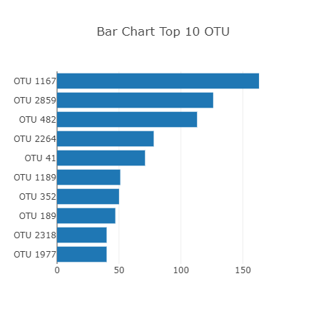
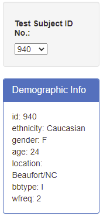

# Plot.ly-challenge: Belly Button Biodiversity

##### Created by: Estela Perez

##

## Background

The purpose of this assignment was to build an interactive dashboard to explore the [Belly Button Biodiversity dataset](http://robdunnlab.com/projects/belly-button-biodiversity/), which catalogs the microbes that colonize human navels.
The dataset reveals that a small handful of microbial species (also called operational taxonomic units, or OTUs, in the study) were present in more than 70% of people, while the rest were relatively rare.

The interactive dashboard can be viewed on my [Belly Button Biodiversity Link](https://eperez3181.github.io/Plot.ly-challenge/)

## Steps
1) Used the D3 library to read in samples.json from URL https://2u-data-curriculum-team.s3.amazonaws.com/dataviz-classroom/v1.1/14-Interactive-Web-Visualizations/02-Homework/samples.json
#
2) Created a horizontal bar chart with a dropdown menu to display the top 10 OTUs found in that individual

#
3) Created a bubble chart which displays each sample

#
4) Displayed individual's demographic information

#
5) Created a gauge chart which shows the weekly washing frequency of an individual

#
6) Displayed all plots on a single dashboard. All plots update when a new sample is selected

  
